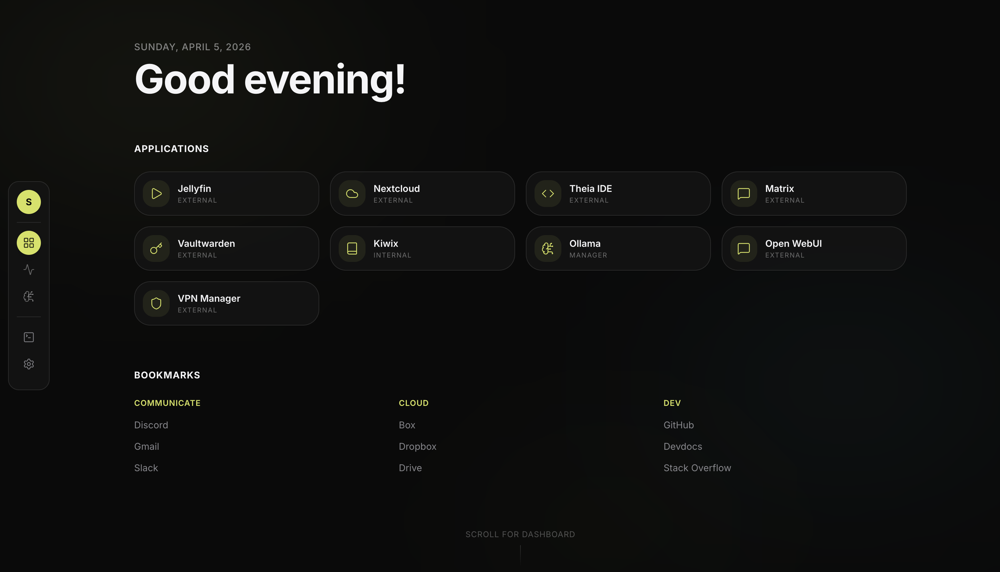
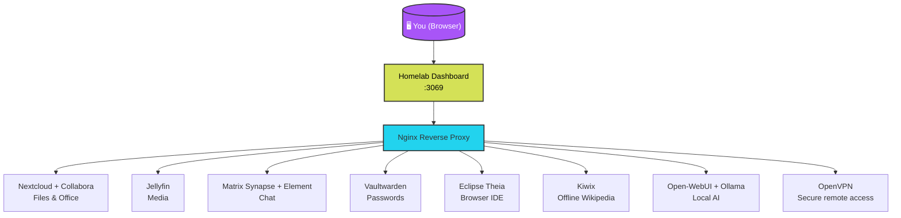
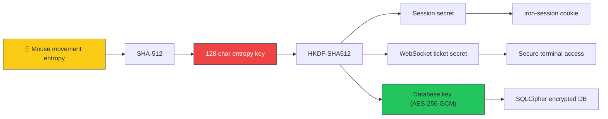
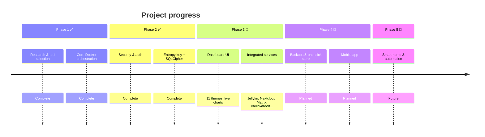

# Homelab Operating System

> One dashboard. One login. Zero cloud dependency. Encryption-first homelab OS.

**Live preview:** [View the landing page →](https://basilsuhail.github.io/ProjectS-HomeForge/)

----

## Architecture at a glance

## Security flow (encryption‑first)

## What we're building (roadmap)

---

## Status

**Pre‑alpha / Private Development** – The source code is not yet public. We are building in private and will share more as we progress.

---

## What is it?

This project bundles the best open‑source tools into a single, encrypted dashboard. Install on a Raspberry Pi, an old PC, or a VPS. Own your data. No cloud subscriptions. No telemetry.

**What’s inside:**
- **Media** – Jellyfin (movies, music, photos)
- **Productivity** – Nextcloud with Collabora Office
- **Chat** – Matrix Synapse + Element
- **Passwords** – Vaultwarden (Bitwarden compatible)
- **Code** – Eclipse Theia IDE
- **Offline knowledge** – Kiwix (Wikipedia, Stack Overflow, etc.)

**Unique feature:** Mouse‑entropy encryption key + SQLCipher at rest. Your data is encrypted with a key derived from your own mouse movements. We never see your key.

---

## What’s working (internal build)

- Dashboard with live resource charts (CPU, RAM, disk, network)
- 11 color themes + glassmorphism UI
- One‑command install on Linux / macOS
- Security layer: Argon2id, AES‑256‑GCM, rate‑limited auth
- All core services integrated and functional

## What’s not yet ready

- Automated backups (planned)
- One‑click module store (planned)
- Mobile companion app (planned)

---

## Get early access

We are looking for early testers who run a homelab and want to try the pre‑alpha build.

👉 **[Request early access – fill out this 2-minute form](https://forms.gle/LNhX4XaBUQvshBqHA)**

(Only email is required. The rest is optional research to help us build what you actually need.)

---

## Team

- **Basil Suhail** – [LinkedIn](https://linkedin.com/in/basilsuhail) | [GitHub](https://github.com/BasilSuhail)
- **Saad Shafique** – [LinkedIn](https://www.linkedin.com/in/saad-shafique-60115934b/) | [GitHub](https://github.com/saadsh15)

---

*This is a public landing page for a pre-alpha project. The source code is currently private.*
